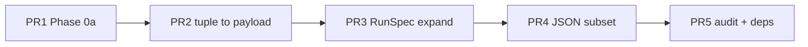

# Sprint: Phase 3b closeout + Phase 0a hardening

| Field | Value |
| :--- | :--- |
| **task_id** | `refactor-phase3b-sprint-20260506` |
| **Roadmap** | `.agents/REFACTOR_ROADMAP.md` §14, §227–238 (Phase 0a), §11 #10 (split acceptance below) |
| **Prior sprint** | `.agents/SPRINT_refactor-phase3-20260505.md` (Phase 3 PR1–PR6; JSON replaced pickle PR5) |
| **Plan audit** | **NEEDS_WORK → accepted with amendments** (2026-05-06): split **§11 #10** (this sprint = spike evidence + go/no-go only; Phase 4 completes “matching implementation”); paste **verification DoD** block; map **PR1** to Phase 0a numeric + HLO + `parity_fast` / optional `parity_heavy`; **PR2/PR3** interface-freeze note. |

## Roadmap §11 item 10 — split acceptance (plan-auditor amendment)

Roadmap text: *“Phase 0a SPIKE outcome documented with go/no-go decision **and matching Phase 4 implementation**.”*

| Slice | Satisfied when | This sprint |
| :--- | :--- | :--- |
| **0a formalization** | Spike tests green; numeric agreement at `get_tolerances("float32")`; HLO summary warnings documented; go/no-go recorded for Phase 4 entry | **PR1** |
| **Matching Phase 4 implementation** | Registry / unify-or-route per spike outcome | **Phase 4 only** — **not** this sprint |

Sprint §14 sign-off must **not** claim full #10 complete until Phase 4 merges.

## Verification DoD (every PR touching `src/` or `tests/`)

Per `AGENTS.md`:

```bash
uv run ty check
uv run ruff check .
uv run ruff format .
uv run pytest
```

**Narrow PRs** may scope `ty` / `ruff` / `pytest` to touched paths; default CI expectation remains full suite where applicable.

**Verification Visibility Protocol:** redirect critical verification to a log file; commit a **filtered** excerpt under `.agents/verification_logs/` when the sprint PR touches parity or spike paths.

**`parity_heavy`:** manual release gate only (`REFERENCE_PATH`); not default CI — see roadmap §10.

## Interface freeze: PR2 vs PR3

Prefer merge order **PR2 → PR3** below. If **PR3** lands first and moves fields from the `RunSpecification` façade into `RunSpec`, **freeze** the payload field contract at the PR2 branch point until PR2 merges, or rebase PR2 onto PR3 to avoid double migration.

---

## PR1 — Phase 0a spike: harden + record Phase 4 **entry** evidence

**Scope:** Tighten `tests/sampling/spikes/test_state_vmap_exact_spike.py` docstrings / markers; optional clearer assertion messages; minimal pointer in `.agents/TECHNICAL_DEBT.md` linking Phase 0a DoD to Q6 / §227.

**DoD:** `PYTHONPATH=src uv run pytest tests/sampling/spikes/test_state_vmap_exact_spike.py -m parity_fast -q` (use `-W default` locally to surface HLO narrative warnings); `uv run pytest tests/parity -m parity_fast -q`; `ty` / `ruff` on touched files.

**Non-goals:** No `strategy_map` / registry refactors; no deletion of `state_vmap_exact`.

**§14 carry:** *Phase 0a: spike + go/no-go rubric recorded; §11 #10 spike slice done — Phase 4 slice pending.*

---

## PR2 — Tuple → payload on remaining JIT-tight sample / MPNN chains

**Scope:** Close remaining tuple-style threading in `make_sample_sequences` / `mpnn` per roadmap §14; keep `parity_fast` + sampling bundle green.

**DoD:** `PYTHONPATH=src uv run pytest` sampling bundle from `CLAUDE.md`; `parity_fast`.

**Non-goals:** Phase 4 registries; `parity_heavy` automation.

**§14 carry:** *Phase 3b: documented JIT chains use payload path; residual call-sites listed if any.*

---

## PR3 — Expand `build_run_spec` / `RunSpec` vs façade

**Scope:** Move inferred knobs from `RunSpecification` into `run/spec.py` + `_sync_run_spec` where safe; preserve deprecation shim.

**DoD:** Spec / CLI tests + `parity_fast`; `ty` / `ruff` on `run/`.

**§14 carry:** *`build_run_spec` owns named field groups; façade exceptions documented.*

---

## PR4 — `RunSpec` JSON subset (after PR3)

**Scope:** Small JSON-safe API for an explicit `RunSpec` field subset + tests; extend Typer only if incremental.

**Defer trigger:** If PR3 is not merged by mid-sprint, defer PR4 and record trigger in §14.

**§14 carry:** *RunSpec JSON subset round-trip for enumerated fields; full Equinox tree JSON out of scope.*

---

## PR5 — Governance: audit refresh + dependency stability + §14

**Scope:** Refresh `rg` audit table in `.agents/TECHNICAL_DEBT.md`; update roadmap §14. **Proxide / PyPI-first:** default is **`proxide>=0.1.0a3` from PyPI**, forced with explicit `[[tool.uv.index]]` and `[tool.uv.sources] proxide = { index = "pypi" }` so `uv.lock` tracks registry wheels; only when deliberately using an **editable local** proxide checkout should `[tool.uv.sources]` point at a path and the PR/sprint record that path or commit (avoid a misleading `==` pin that does not match resolution).

**DoD:** `parity_fast`; filtered verification log for audit command if required by policy.

**§14 carry:** *Phase 3b signed off; Phase 4 prep listed with triggers.*

---

## Explicitly out of scope (whole sprint)

Phase 4 `registry.py`, `_COMBINE_INDEX`, `MULTISTATE_MODES`, `SAMPLERS`, deleting `state_vmap_exact`, `parity_heavy` in CI, pickle migration revival, `mpnn.py` split (5a–5e), io_callback / `SamplingDriver`.

---

## Dependency sketch (preferred merge order)



PR1 may merge independently early to establish the Phase 4 **entry** record before large PR2/PR3 diffs.
