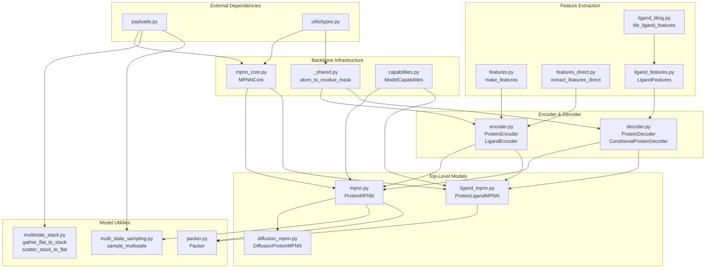
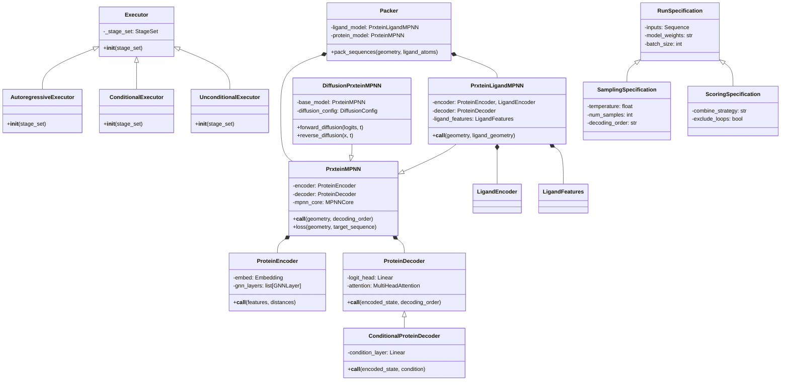
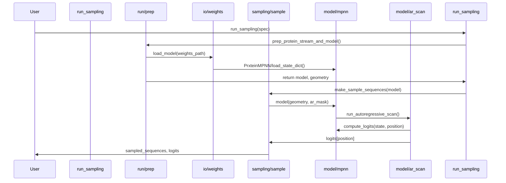
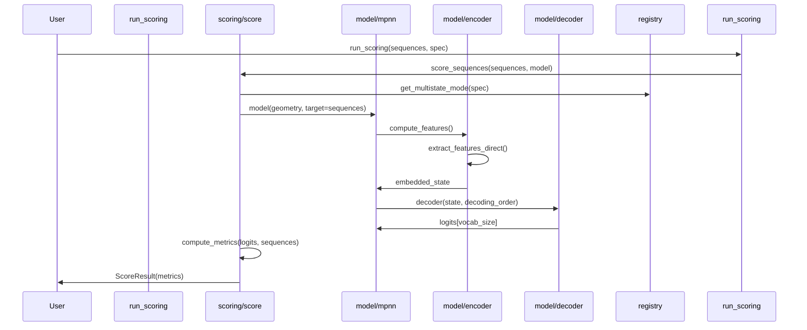
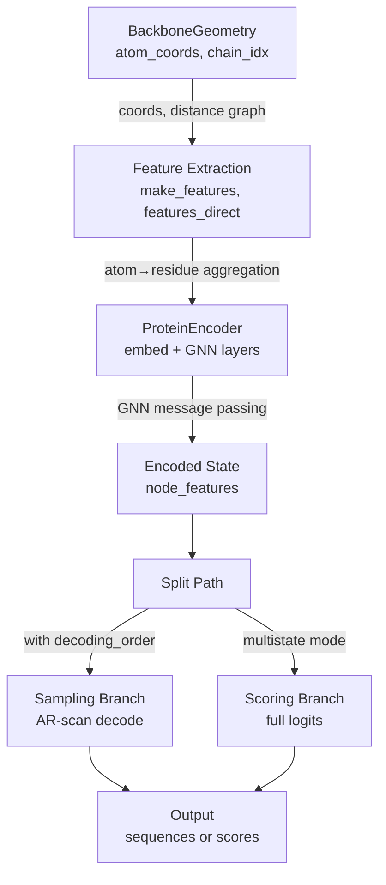

# PrxteinMPNN Codebase Map

Generated from AST analysis of `src/prxteinmpnn/` (136 Python files, ~30,000 LOC).

---

## 1. High-Level Module Dependency Map

```mermaid
graph TD
    subgraph Core["Core Foundation"]
        A[payloads.py]
        B[protocols.py]
        C[registry.py]
        D[pipeline_registry.py]
        E[model_inputs.py]
        F[padding.py]
    end

    subgraph Model["Model Layer"]
        M1[mpnn.py<br/>PrxteinMPNN]
        M2[ligand_mpnn.py<br/>PrxteinLigandMPNN]
        M3[diffusion_mpnn.py<br/>DiffusionPrxteinMPNN]
        M4[encoder.py]
        M5[decoder.py]
        M6[features.py]
        M7[packer.py]
        M8[mpnn_core.py]
        M9[capabilities.py]
    end

    subgraph Sampling["Sampling & Generation"]
        S1[sampling/sample.py]
        S2[sampling/conditional_logits.py]
        S3[sampling/unconditional_logits.py]
        S4[sampling/state_vmap_prep.py]
        S5[sampling/ste_optimize.py]
    end

    subgraph Run["Run & Pipeline"]
        R1[run/sampling.py]
        R2[run/scoring.py]
        R3[run/specs.py]
        R4[run/campaign.py]
        R5[run/prep.py]
        R6[run/averaging.py]
        R7[pipeline_fns.py]
    end

    subgraph IO["I/O & Training"]
        I1[io/weights.py]
        I2[io/designs.py]
        I3[training/trainer.py]
        I4[training/losses.py]
        I5[training/diffusion.py]
    end

    subgraph Pipeline["Pipeline & Execution"]
        P1[pipeline/autoregressive.py]
        P2[pipeline/conditional.py]
        P3[pipeline/unconditional.py]
        P4[pipeline/ste.py]
        P5[executor/base.py]
        P6[executor/autoregressive.py]
        P7[executor/conditional.py]
        P8[executor/unconditional.py]
    end

    subgraph Utils["Utilities & Analysis"]
        U1[utils/types.py]
        U2[utils/autoregression.py]
        U3[utils/coordinates.py]
        U4[utils/decoding_order.py]
        U5[ensemble/]
        U6[parity/]
        U7[profiling/]
    end

    A --> B
    B --> C
    C --> D
    A --> E
    E --> M1
    E --> M2
    M1 --> M4
    M1 --> M5
    M1 --> M6
    M2 --> M4
    M2 --> M5
    M3 --> M1
    A --> S1
    B --> S1
    S1 --> M1
    S2 --> B
    S3 --> B
    S4 --> E
    R1 --> S1
    R1 --> R5
    R2 --> S1
    R3 --> C
    R4 --> R1
    R4 --> R2
    I1 --> M1
    I1 --> M2
    I1 --> M3
    I2 --> B
    P1 --> D
    P5 --> D
    P6 --> P5
    P7 --> P5
    U1 --> Core
    U2 --> S1
    U3 --> M6
```

---

## 2. model/ Internal Dependency Graph

---

## 3. Class Hierarchy

---

## 4. Key Call Flows

### 4a. Sampling Path

### 4b. Scoring Path

### 4c. Model Encoding Path

---

## Module Organization Summary

### Core Protocols & Payloads
- **payloads.py**: `MultistateStackPayload`, `LigandStack`, `EncoderOutput`
- **protocols.py**: `ConditionalLogitsFn`, `UnconditionalLogitsFn`, `SamplerFn`, `ScoreFn`
- **registry.py**: `Registry`, multistate mode management
- **model_inputs.py**: `BackboneGeometry`, `SamplingInputs`

### Model Architecture (107 modules, heavily interconnected)
- **Core Models**: `PrxteinMPNN` (1406 LOC), `PrxteinLigandMPNN` (1389 LOC), `DiffusionPrxteinMPNN` (324 LOC)
- **Encoder Stack**: `ProteinEncoder`, `LigandEncoder` (312 LOC)
- **Decoder Stack**: `ProteinDecoder`, `ConditionalProteinDecoder` (498 LOC)
- **Features**: `make_features`, `extract_features_direct`, `LigandFeatures` (841 LOC total)
- **Infrastructure**: `MPNNCore`, `_shared`, `ModelCapabilities`

### Sampling & Generation (895 LOC total)
- **sample.py**: Token-level autoregressive sampling
- **conditional_logits.py**: Conditioned logit computation
- **unconditional_logits.py**: Unconditioned logit computation
- **state_vmap_prep.py**: Batched encoding preparation
- **ste_optimize.py**: Straight-through estimator optimization

### Run Pipeline (3000+ LOC)
- **sampling.py**: High-level sampling orchestration (1964 LOC)
- **scoring.py**: Sequence scoring (611 LOC)
- **campaign.py**: Multi-task campaign runner (1402 LOC)
- **specs.py**: Specification dataclasses (525 LOC)
- **prep.py**: Model loading and prep

### Pipeline & Execution
- **pipeline/*.py**: `AutoregressivePipeline`, `ConditionalPipeline`, `UnconditionalPipeline`, `STEPipeline`
- **executor/*.py**: `Executor` (base), `AutoregressiveExecutor`, `ConditionalExecutor`, `UnconditionalExecutor`
- **pipeline_fns.py**: Factory functions for pipeline construction

### I/O & Training (1500+ LOC)
- **io/weights.py**: Model serialization (280 LOC)
- **io/designs.py**: Design output streaming (210 LOC)
- **training/trainer.py**: Model training loop (884 LOC)
- **training/losses.py**: CE and KL loss functions
- **training/diffusion.py**: Diffusion model training

### Ensemble & Analysis
- **ensemble/**: Clustering (DBSCAN, K-Means), PCA, GMM, EM fitting, von Mises mixture (1400+ LOC)
- **parity/**: Reference equivalence validation (664 LOC)
- **profiling/**: HLO profiling and sampler benchmarking

### Utilities (2200+ LOC)
- **types.py**: Type definitions and metrics
- **autoregression.py**: AR mask generation
- **coordinates.py**: Distance and spatial computations
- **decoding_order.py**: Decoding order strategies
- **batching.py**: Memory-aware batch planning
- **align.py**: Sequence alignment (600 LOC)
- **catjac.py**: Categorical Jacobian computation

---

## Key Design Patterns

1. **Protocol-Driven Design**: `ConditionalLogitsFn`, `UnconditionalLogitsFn`, `SamplerFn`, `ScoreFn` define interfaces.
2. **Registry Pattern**: Multistate modes, pipeline stages, and batching specs managed via `Registry` and `PipelineRegistry`.
3. **Executor Pattern**: `Executor` base class with subclasses (`AutoregressiveExecutor`, etc.) orchestrate pipeline stages.
4. **State Vmap Preparation**: `state_vmap_prep` vectorizes encoding over multiple structure states in parallel.
5. **Autoregressive Scan**: Position-by-position decoding with masking to prevent information leakage.
6. **Ligand Conditioning**: Separate `LigandEncoder` and `LigandFeatures` for protein-ligand complexes.
7. **Diffusion Extensions**: `DiffusionPrxteinMPNN` extends base `PrxteinMPNN` with time-dependent embeddings.

---

## Data Flow Layers

### Inference (Sampling / Scoring)
1. **Input**: `BackboneGeometry` (atom coordinates, chain indices)
2. **Feature Extraction**: `make_features` → `ProteinFeatures` + optional ligand context
3. **Encoding**: `ProteinEncoder` → node embeddings via GNN message passing
4. **Decoding**: `ProteinDecoder` → position-wise logits
5. **Autoregressive Loop** (sampling only): Mask positions, sample, update AR state
6. **Output**: Sequences (sampling) or metrics (scoring)

### Training
1. **Input**: Sequences + structures
2. **Feature Extraction**: Same as inference
3. **Encoding**: Same as inference
4. **Loss Computation**: Compare logits to target sequences (CE loss)
5. **Backprop**: Gradients through model weights
6. **Checkpoint**: Save model state

### Ensemble Analysis
1. **Conformational States**: Cluster structures via DBSCAN / GMM
2. **Per-State Sampling**: Run sampling per state, collect consensus
3. **State Validation**: BIC, EM fitting, von Mises mixture
4. **Downstream**: PCA, K-Means for further analysis

---

## Notable File Sizes (LOC)

| File | LOC | Purpose |
|------|-----|---------|
| mpnn.py | 1406 | Main model |
| ligand_mpnn.py | 1389 | Ligand-conditioned variant |
| run/sampling.py | 1964 | Sampling orchestration |
| run/campaign.py | 1402 | Multi-task runner |
| trainer.py | 884 | Training loop |
| sampling/sample.py | 895 | Token-level AR sampling |
| decoder.py | 498 | Decoding layers |
| io/weights.py | 280 | Model serialization |

---

## Dependency Principles

1. **No cycles**: All dependencies form a DAG (core → model → sampling → run).
2. **Protocol isolation**: Interfaces in `protocols.py` decouple implementations.
3. **Type safety**: `utils/types.py` defines all major array aliases (Logits, ProteinSequence, etc.).
4. **Batching isolation**: `utils/batching_registry.py` centralizes batch plan logic.
5. **Executor reuse**: Pipeline stages wired through `StageSet` to enable reuse across sampling, scoring, conformational inference.

