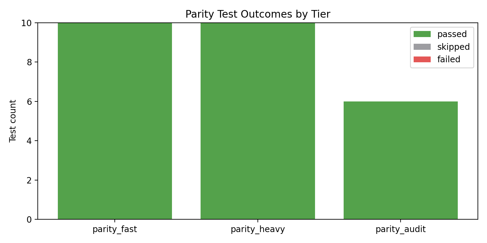
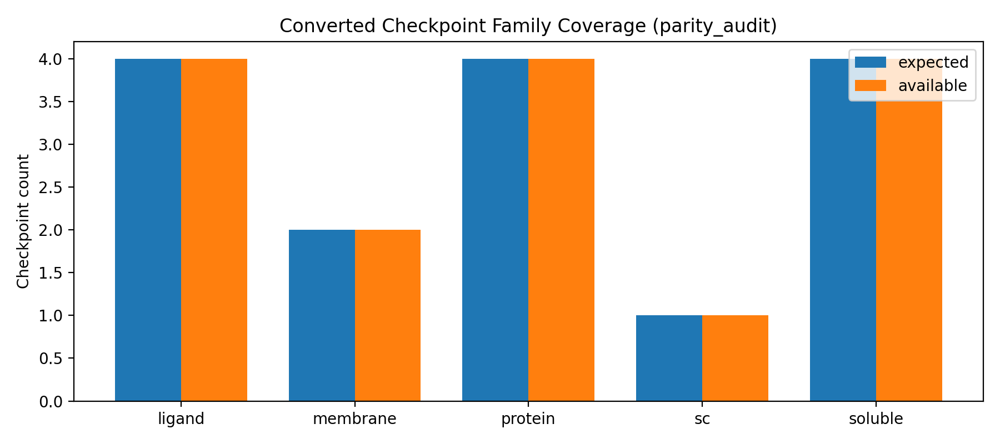
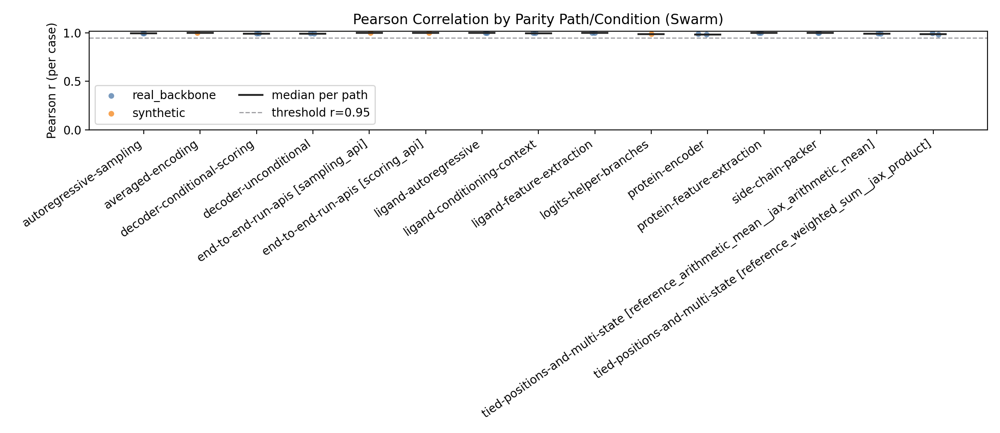
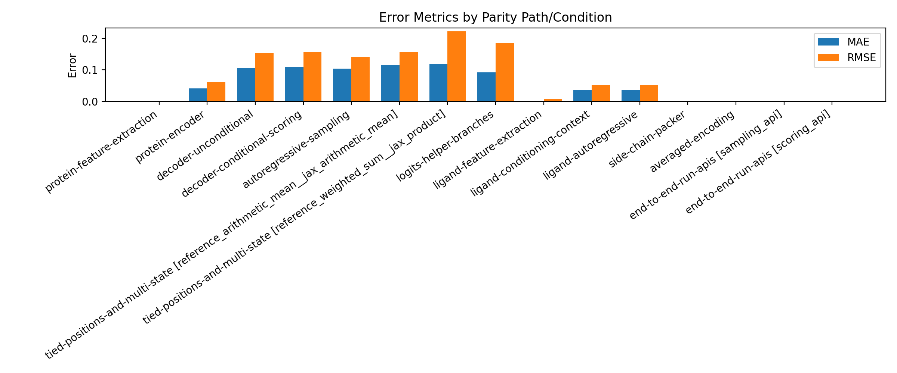
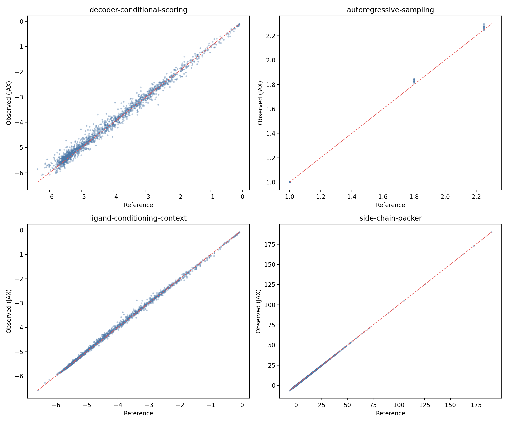
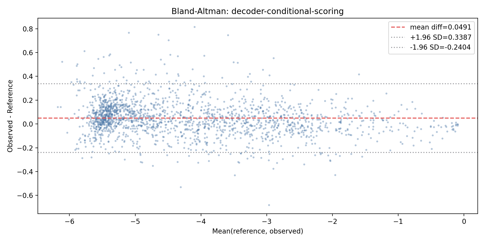
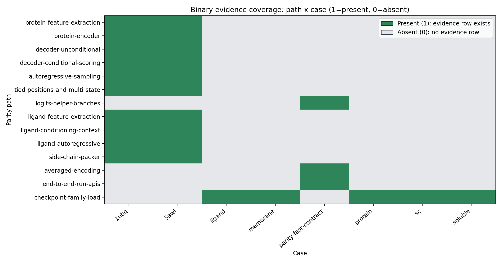
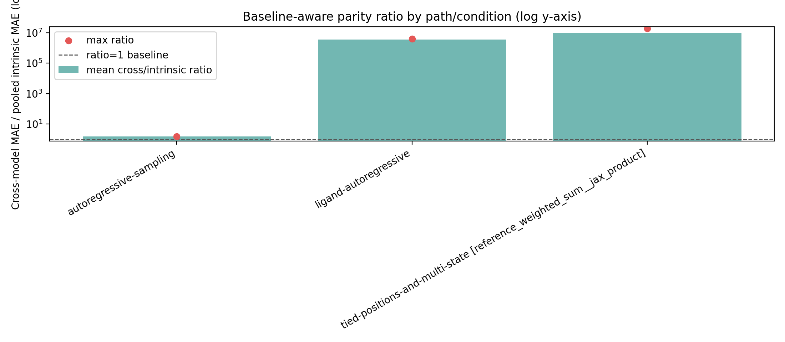
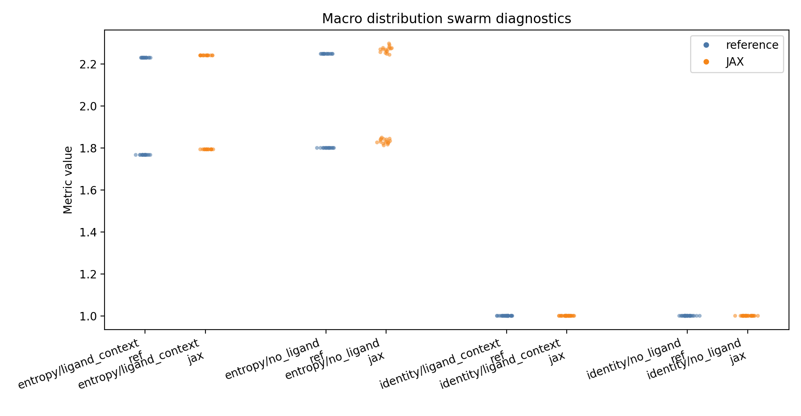
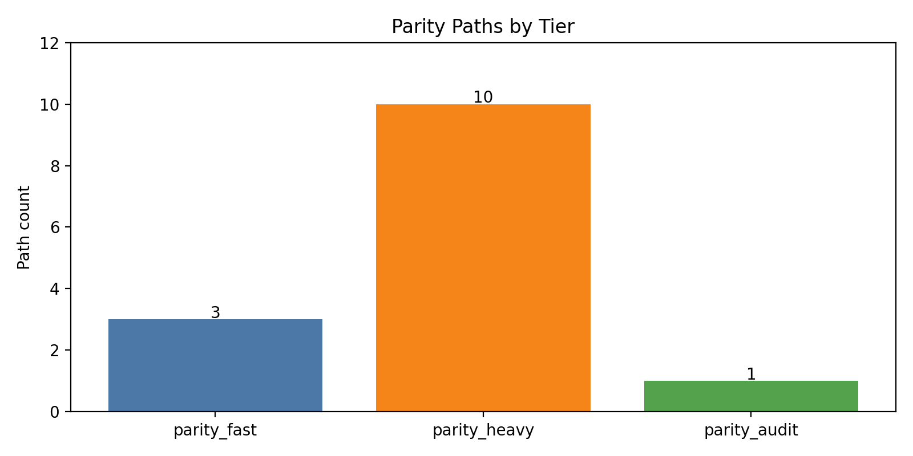

# Parity Assessment Report

Generated: **2026-04-09T23:54:48+00:00** (UTC)

## Executive parity snapshot

**Status:** Tier checks and collected lane evidence currently support parity on this corpus.

### Key outcomes

- Tier outcomes: 26/26 passed, 0 failed, 0 skipped.
- Coverage map: 14 instrumented, 0 pending, 0 excluded.
- Scalar evidence spans 15 path/condition lanes; Pearson metrics are present in 15 lanes.

### Caveats

- Intrinsic ratios use pooled intrinsic MAE in the denominator; near-zero baselines can inflate ratios for ligand-autoregressive, tied-positions-and-multi-state [reference_weighted_sum__jax_product].
- Side-chain-conditioned integration gate reports 2 warning verdict(s), driven by excluded corpus lanes.

## How parity is assessed

1. **`parity_fast`**: deterministic fixture and helper-branch parity checks (no upstream checkout required).
2. **`parity_heavy`**: reference-backed numerical parity checks against pinned LigandMPNN.
3. **`parity_audit`**: converted checkpoint-family load/audit checks across model families.

## Terminology / interpretation legend

| Term | Interpretation |
| --- | --- |
| Mean r / Min r | Pearson correlation summaries per path/condition lane; values nearer 1 indicate tighter parity. |
| Pearson pass rate | Fraction of per-case Pearson checks passing policy thresholds for that lane. |
| n/a(categorical | pending | excluded) | Metric intentionally absent because the path is categorical, not instrumented, or excluded. |
| Cross/intrinsic ratio | Cross-model MAE divided by pooled intrinsic MAE; near-zero denominators can inflate ratios. |
| Coverage heatmap values | Binary semantics only: 1 means at least one evidence row is present; 0 means absent. |

## Tier test outcomes (from JUnit)

| Tier | Tests | Passed | Skipped | Failed | Notes |
| --- | ---: | ---: | ---: | ---: | --- |
| `parity_fast` | 10 | 10 | 0 | 0 |  |
| `parity_heavy` | 10 | 10 | 0 | 0 |  |
| `parity_audit` | 6 | 6 | 0 | 0 |  |

_Figure: Stacked JUnit pass/skip/fail totals per tier; this is the first release gate for triage._

## Converted family checkpoint coverage

| Family | Expected converted | Available locally |
| --- | ---: | ---: |
| `ligand` | 4 | 4 |
| `membrane` | 2 | 2 |
| `protein` | 4 | 4 |
| `sc` | 1 | 1 |
| `soluble` | 4 | 4 |

_Figure: Expected vs locally present converted checkpoints for `parity_audit`; missing assets block audit evidence collection._

## Expanded evidence summary

### Evaluated protein systems and cases

Case metadata below is extracted directly from collected evidence rows.

| Case ID | Kind | Length(s) | Seed(s) | Backbone ID(s) | Checkpoint ID(s) | Tier(s) | Paths |
| --- | --- | --- | --- | --- | --- | --- | ---: |
| `1ubq` | `real_backbone` | 76 | 388 | 1ubq | ligandmpnn_sc_v_32_002_16, ligandmpnn_v_32_020_25, proteinmpnn_v_48_020 | parity_heavy | 10 |
| `5awl` | `real_backbone` | 10 | 388 | 5awl | ligandmpnn_sc_v_32_002_16, ligandmpnn_v_32_020_25, proteinmpnn_v_48_020 | parity_heavy | 10 |
| `ligand` | `audit_family` | n/a | n/a | ligand | converted_checkpoints | parity_audit | 1 |
| `membrane` | `audit_family` | n/a | n/a | membrane | converted_checkpoints | parity_audit | 1 |
| `parity-fast-contract` | `synthetic` | 76 | 489 | synthetic | proteinmpnn_v_48_020 | parity_fast | 3 |
| `protein` | `audit_family` | n/a | n/a | protein | converted_checkpoints | parity_audit | 1 |
| `sc` | `audit_family` | n/a | n/a | sc | converted_checkpoints | parity_audit | 1 |
| `soluble` | `audit_family` | n/a | n/a | soluble | converted_checkpoints | parity_audit | 1 |

### Tied/multistate apples-to-apples lanes

Configured tied/multistate lanes are listed beside evidence tables so unlike strategies never merge.

| Condition | Comparison API | Reference combiner | JAX strategy | Token comparison | Primary |
| --- | --- | --- | --- | --- | --- |
| `reference_weighted_sum__jax_product` | `sampling` | `weighted_sum` | `product` | `enabled` | `yes` |
| `reference_arithmetic_mean__jax_arithmetic_mean` | `scoring` | `arithmetic_mean` | `arithmetic_mean` | `disabled` | `no` |

Evidence metrics: `docs/parity/reports/evidence/evidence_metrics.csv`
Point samples: `docs/parity/reports/evidence/evidence_points.csv`

Condition labels isolate strategy lanes (for example, tied/multistate apples-to-apples comparisons).

| Path | Condition | Cases | Mean r | Min r | Pearson pass rate | Mean MAE | Mean RMSE | Mean token agreement |
| --- | --- | ---: | ---: | ---: | ---: | ---: | ---: | ---: |
| `protein-feature-extraction` | `default` | 2 | 1.0000 | 1.0000 | n/a | 0.0000 | 0.0000 | n/a |
| `protein-encoder` | `default` | 2 | 0.9863 | 0.9794 | 1.0000 | 0.0407 | 0.0623 | n/a |
| `decoder-unconditional` | `default` | 2 | 0.9937 | 0.9927 | 1.0000 | 0.1046 | 0.1536 | n/a |
| `decoder-conditional-scoring` | `default` | 2 | 0.9938 | 0.9933 | 1.0000 | 0.1082 | 0.1558 | n/a |
| `autoregressive-sampling` | `default` | 2 | 0.9950 | 0.9948 | 1.0000 | 0.1037 | 0.1417 | 1.0000 |
| `autoregressive-sampling` | `no_ligand` | 2 | n/a | n/a | n/a | n/a | n/a | n/a |
| `tied-positions-and-multi-state` | `reference_arithmetic_mean__jax_arithmetic_mean` | 2 | 0.9928 | 0.9920 | 1.0000 | 0.1161 | 0.1555 | n/a |
| `tied-positions-and-multi-state` | `reference_weighted_sum__jax_product` | 2 | 0.9897 | 0.9831 | 1.0000 | 0.1194 | 0.2225 | 0.7171 |
| `logits-helper-branches` | `default` | 1 | 0.9888 | 0.9888 | n/a | 0.0920 | 0.1854 | n/a |
| `ligand-feature-extraction` | `default` | 2 | 1.0000 | 1.0000 | n/a | 0.0012 | 0.0060 | n/a |
| `ligand-conditioning-context` | `default` | 2 | 0.9991 | 0.9988 | 1.0000 | 0.0350 | 0.0515 | n/a |
| `ligand-autoregressive` | `default` | 2 | 0.9993 | 0.9991 | 1.0000 | 0.0350 | 0.0515 | 1.0000 |
| `ligand-autoregressive` | `ligand_context` | 2 | n/a | n/a | n/a | n/a | n/a | n/a |
| `ligand-autoregressive` | `side_chain_conditioned` | 2 | n/a | n/a | n/a | n/a | n/a | n/a |
| `side-chain-packer` | `default` | 2 | 1.0000 | 1.0000 | 1.0000 | 0.0000 | 0.0000 | n/a |
| `averaged-encoding` | `default` | 1 | 1.0000 | 1.0000 | n/a | 0.0000 | 0.0000 | n/a |
| `end-to-end-run-apis` | `sampling_api` | 1 | 1.0000 | 1.0000 | n/a | 0.0000 | 0.0000 | 1.0000 |
| `end-to-end-run-apis` | `scoring_api` | 1 | 1.0000 | 1.0000 | n/a | 0.0000 | 0.0000 | n/a |
| `checkpoint-family-load` | `ligand` | 1 | n/a(categorical) | n/a(categorical) | n/a(categorical) | n/a(categorical) | n/a(categorical) | n/a(categorical) |
| `checkpoint-family-load` | `membrane` | 1 | n/a(categorical) | n/a(categorical) | n/a(categorical) | n/a(categorical) | n/a(categorical) | n/a(categorical) |
| `checkpoint-family-load` | `protein` | 1 | n/a(categorical) | n/a(categorical) | n/a(categorical) | n/a(categorical) | n/a(categorical) | n/a(categorical) |
| `checkpoint-family-load` | `sc` | 1 | n/a(categorical) | n/a(categorical) | n/a(categorical) | n/a(categorical) | n/a(categorical) | n/a(categorical) |
| `checkpoint-family-load` | `soluble` | 1 | n/a(categorical) | n/a(categorical) | n/a(categorical) | n/a(categorical) | n/a(categorical) | n/a(categorical) |

_Figure: Pearson swarm across lane-level case rows (n=26). Each point is one path/condition/case/seed value, black ticks mark medians, and the dashed line marks the r=0.95 policy floor._

_Figure: Mean MAE and RMSE across 15 scalar-metric lanes. Rows shown as `n/a(...)` are pending, excluded, or categorical by design._

_Figure: Reference vs JAX scatter samples for core paths; tighter diagonal alignment indicates stronger parity. Dense clouds may be downsampled for readability._

_Figure: Bland-Altman view for decoder-conditional-scoring. The center line is mean drift and dotted lines show ±1.96 SD._

_Figure: Binary coverage matrix (14 paths × 8 cases): green=present (>=1 evidence row), gray=absent. Color intensity does not encode magnitude._

### Baseline-aware intrinsic parity

| Path | Condition | Cases | Mean cross/intrinsic ratio | Max ratio | Pass@95 envelope | Pass@99 envelope |
| --- | --- | ---: | ---: | ---: | ---: | ---: |
| `autoregressive-sampling` | `default` | 2 | 1.5317 | 1.5414 | 1.0000 | 1.0000 |
| `ligand-autoregressive` | `default` | 2 | 3502778.8255 | 4022871.0279 | 0.0000 | 0.0000 |
| `tied-positions-and-multi-state` | `reference_weighted_sum__jax_product` | 2 | 9363044.0153 | 18726084.4878 | 0.0000 | 0.0000 |

_Figure: Log-scale cross/intrinsic ratio chart across 3 lane(s). The denominator is pooled intrinsic MAE, so near-zero baselines can inflate ratios._

### Macro distribution parity

| Path | Condition | Cases | Mean identity Wasserstein | Mean entropy Wasserstein | Mean composition JS | Median identity KS p-value |
| --- | --- | ---: | ---: | ---: | ---: | ---: |
| `autoregressive-sampling` | `no_ligand` | 2 | 0.0000 | 0.0261 | 0.0000 | 1.0000 |
| `ligand-autoregressive` | `ligand_context` | 2 | 0.0000 | 0.0187 | 0.0000 | 1.0000 |
| `ligand-autoregressive` | `side_chain_conditioned` | 2 | n/a(Excluded by parity case corpus configuration.) | n/a(Excluded by parity case corpus configuration.) | n/a(Excluded by parity case corpus configuration.) | n/a(Excluded by parity case corpus configuration.) |

### Side-chain-conditioned integration gate

| Path | Condition | Cases | Pass | Warn | Fail | Outcome | Reason |
| --- | --- | ---: | ---: | ---: | ---: | --- | --- |
| `ligand-autoregressive` | `side_chain_conditioned` | 2 | 0 | 2 | 0 | `warn` | Excluded by parity case corpus configuration. |

_Figure: Macro swarm compares reference vs JAX identity/entropy points by condition. Overlap implies better distributional parity; excluded lanes remain `n/a(...)`._

### Coverage and exclusions

| Path | Tier | Status | Reason |
| --- | --- | --- | --- |
| `protein-feature-extraction` | `parity_heavy` | `instrumented` | Path has collected evidence rows. |
| `protein-encoder` | `parity_heavy` | `instrumented` | Path has collected evidence rows. |
| `decoder-unconditional` | `parity_heavy` | `instrumented` | Path has collected evidence rows. |
| `decoder-conditional-scoring` | `parity_heavy` | `instrumented` | Path has collected evidence rows. |
| `autoregressive-sampling` | `parity_heavy` | `instrumented` | Path has collected evidence rows. |
| `tied-positions-and-multi-state` | `parity_heavy` | `instrumented` | Path has collected evidence rows. |
| `logits-helper-branches` | `parity_fast` | `instrumented` | Path has collected evidence rows. |
| `ligand-feature-extraction` | `parity_heavy` | `instrumented` | Path has collected evidence rows. |
| `ligand-conditioning-context` | `parity_heavy` | `instrumented` | Path has collected evidence rows. |
| `ligand-autoregressive` | `parity_heavy` | `instrumented` | Path has collected evidence rows. |
| `side-chain-packer` | `parity_heavy` | `instrumented` | Path has collected evidence rows. |
| `averaged-encoding` | `parity_fast` | `instrumented` | Path has collected evidence rows. |
| `end-to-end-run-apis` | `parity_fast` | `instrumented` | Path has collected evidence rows. |
| `checkpoint-family-load` | `parity_audit` | `instrumented` | Audit path is categorical; correlation and error columns are intentionally n/a. |

## Appendix: path inventory and definitions

### Parity path definitions

| Path | Tier | Method | Metrics | Code paths |
| --- | --- | --- | --- | --- |
| `protein-feature-extraction` | `parity_heavy` | intermediate tensor parity | shape equality, allclose, max abs diff | `src/prxteinmpnn/model/features.py` |
| `protein-encoder` | `parity_heavy` | layer-by-layer activation parity | correlation, max abs diff, per-layer trace | `src/prxteinmpnn/model/encoder.py` |
| `decoder-unconditional` | `parity_heavy` | end-logit parity | pearson correlation, per-position KL, per-position CE | `src/prxteinmpnn/model/decoder.py, src/prxteinmpnn/model/mpnn.py` |
| `decoder-conditional-scoring` | `parity_heavy` | logits and score parity | pearson correlation, score delta, nll drift | `src/prxteinmpnn/model/decoder.py, src/prxteinmpnn/scoring/score.py, src/prxteinmpnn/run/scoring.py` |
| `autoregressive-sampling` | `parity_heavy` | stepwise deterministic sample parity | stepwise logit drift, token agreement, sequence recovery | `src/prxteinmpnn/sampling/sample.py, src/prxteinmpnn/run/sampling.py, src/prxteinmpnn/model/mpnn.py` |
| `tied-positions-and-multi-state` | `parity_heavy` | group-combined branch parity with explicit apples-to-apples comparison lanes | group correlation, strategy invariants | `src/prxteinmpnn/utils/autoregression.py, src/prxteinmpnn/model/multi_state_sampling.py, src/prxteinmpnn/sampling/sample.py` |
| `logits-helper-branches` | `parity_fast` | helper vs direct branch parity | allclose, shape equality | `src/prxteinmpnn/sampling/unconditional_logits.py, src/prxteinmpnn/sampling/conditional_logits.py` |
| `ligand-feature-extraction` | `parity_heavy` | ligand node/edge parity | shape equality, masked behavior | `src/prxteinmpnn/model/ligand_features.py` |
| `ligand-conditioning-context` | `parity_heavy` | context encoder parity | hidden-state correlation, final logit correlation | `src/prxteinmpnn/model/mpnn.py` |
| `ligand-autoregressive` | `parity_heavy` | deterministic ligand sample parity | stepwise agreement, final agreement | `src/prxteinmpnn/model/mpnn.py` |
| `side-chain-packer` | `parity_heavy` | encode/decode torsion parity | mean allclose, concentration allclose, mix logits allclose, output correlation | `src/prxteinmpnn/model/packer.py` |
| `averaged-encoding` | `parity_fast` | deterministic averaged encoding parity | shape equality, average drift | `src/prxteinmpnn/run/averaging.py` |
| `end-to-end-run-apis` | `parity_fast` | fixture-driven API parity | output shape, score contract, pseudo-perplexity contract | `src/prxteinmpnn/run/scoring.py, src/prxteinmpnn/run/sampling.py` |
| `checkpoint-family-load` | `parity_audit` | load and smoke forward pass | load success, smoke pass, shape compatibility | `src/prxteinmpnn/io/weights.py, src/prxteinmpnn/model/*.py` |

### Tier path inventory

| Tier | Path count |
| --- | ---: |
| `parity_fast` | 3 |
| `parity_heavy` | 10 |
| `parity_audit` | 1 |

_Figure: Inventory-only path counts by tier. Larger bars indicate broader instrumentation, not stronger parity._

Checkpoint checksum snapshot: `reports/converted_checkpoint_checksums.txt`

